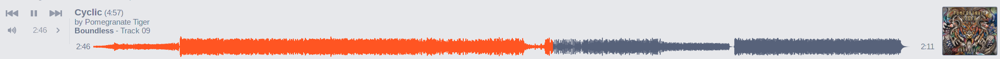

An improved version of this plugin has since been merged into QuodLibet. So, you know, just ignore this.

#Installation
1. Copy `waveformseekbarplugin.py` to `~/.quodlibet/plugins/`
2. Restart QuodLibet
3. Go to File > Plugins and make sure the "Alternative Seek Bar" plugin is disabled
4. Enable the "Waveform Seek Bar" plugin

#Screenshot

